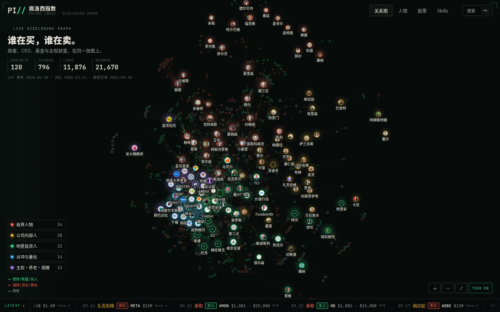

# PI// 佩洛西指数 · Pelosi Index

**谁在买，谁在卖。政客、CEO、基金与主权财富，在同一张图上。**

[在线体验](https://pelosi.pocketplay.win/) · [参与贡献](CONTRIBUTING.md) · [数据口径](docs/DATA.md) · [English](docs/README.en.md)



佩洛西指数把公开财务披露变成一张可以拖动、缩放、搜索和巡游的关系图。点击人物或股票，可以查看报告日期、交易/持仓明细与原件链接。品牌中的“指数”不是收益指数，项目没有实时行情或收益预测。

欢迎通过 Issue 和 Pull Request 一起补充人物、接入官方数据源、改进图谱与修正解析。首次贡献可以从数据纠错、手机布局、文档或无障碍改进开始。

## 开始运行

需要 Node.js 20.19+ 和 Python 3.10+。仓库包含 **2026-10-05 的公开数据快照**，运行网站不需要 API Key，也不需要先下载原始报告。

```sh
git clone https://github.com/bigerbigernerd/PelosiIndex.git
cd PelosiIndex
npm ci
npm run dev
```

打开 `http://127.0.0.1:5190`。构建静态站点：

```sh
npm test
npm run build
npm run preview
```

构建产物在 `web/dist/`；静态主机需将 `/people/`、`/stocks/`、`/skills/` 及对应的 `/en/` 路由指向各自的 `index.html`。详情见 [架构与自托管](docs/ARCHITECTURE.md)。

## 可以探索什么

- **关系图**：Canvas + d3-force、像素头像、买卖光点、分类筛选、闲置巡游和快捷搜索。
- **人物**：政界人物、公司内部人、明星投资人、对冲与量化、主权/养老/捐赠机构五类。
- **股票**：从证券反查不同主体的公开披露关联。
- **研究 Skills**：13F 季度对比、House PTR、Form 4、图谱数据、披露研究报告、人物与数据贡献；可下载并用于支持 Skills 的 agent。

快照包含 121 个主体、797 只证券、11,877 条完整关联、21,673 条解析记录。首页为便于阅读只画 852 条精选关联；股票详情读取完整关系。这些是有明确日期和覆盖范围的历史披露，不能解释为实时交易流或完整投资组合。

Skills 的源码与安装入口见 [六个研究 Skills](skills/README.md)。

## 数据怎么来

| 来源 | 内容 | 必须保留的口径 |
| --- | --- | --- |
| 众议院书记官 House PTR | 议员及家属的申报交易 | 金额区间、Owner、交易日期与申报日期；扫描件不给猜测值 |
| SEC Form 4 | 公司内部人交易 | 交易代码、衍生/非衍生、直接/间接持有、10b5-1 |
| SEC 13F | 机构季度披露 | 季末快照、修订、保密省略与报告可比性 |

已核验的规范化中间数据在 `research/v2/out/`。重新生成图谱和 Skills：

```sh
npm run data
npm test
```

如需从原始文件完整重建，先阅读 [数据重建与审核](docs/DATA.md)。仓库记录了 566 个官方源文件的 URL、SHA-256 和本地路径，原件按需下载，不把采集聊天、候选分析或生产配置混入贡献流程。

特朗普已通过两份 2024 年 SEC Form 4 历史原件接入，赠与信托与 earnout 不归为主动买卖。OGE 与参议院披露适配器尚未接入。新增数据源请先开 Issue 讨论口径，再提交原件、解析器和审核证据。

## 贡献

1. Fork 仓库，在分支上修改。
2. 运行 `npm test` 与 `npm run build`；界面修改附桌面和手机截图。
3. 提交 PR，说明变更、原件来源和验证方法。

详见 [贡献指南](CONTRIBUTING.md)。PR 通过检查后仍需维护者审核；不会自动修改线上站点。

## 许可与素材

项目原创代码与文档使用 [MIT License](LICENSE)。第三方图像、商标、公开报告与衍生数据不因代码开源而获得 MIT 重新授权；各自的来源与许可见 [THIRD_PARTY_NOTICES.md](THIRD_PARTY_NOTICES.md) 和 `web/public/data/v2/credits.json`。House PTR 保留其法定用途限制；数据口径与访问要求见 [docs/DATA.md](docs/DATA.md)。

## 宣传片 / Remotion promo

`video/pelosi-promo/` 包含 40 秒英文宣传片、原中文草稿、原创电子配乐、英语配音与可编辑镜头。默认无字幕，所有素材随源码保存。

```sh
cd video/pelosi-promo
npm ci
npm run dev -- --port 5198
```

打开 `http://localhost:5198/PelosiPromo-English`。运行与配音重建说明见 [宣传片 README](video/pelosi-promo/README.md)。网站和宣传片各自安装依赖；仓库不包含模型权重或生产配置。
